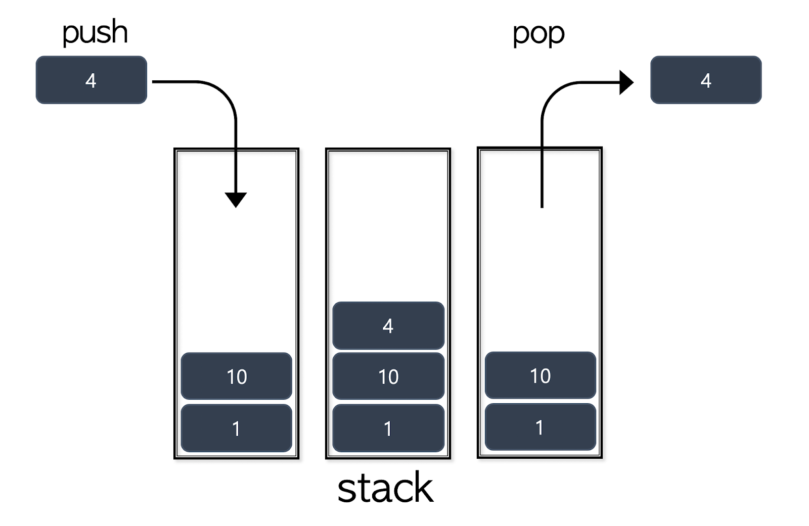
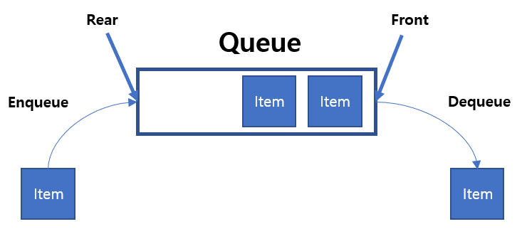
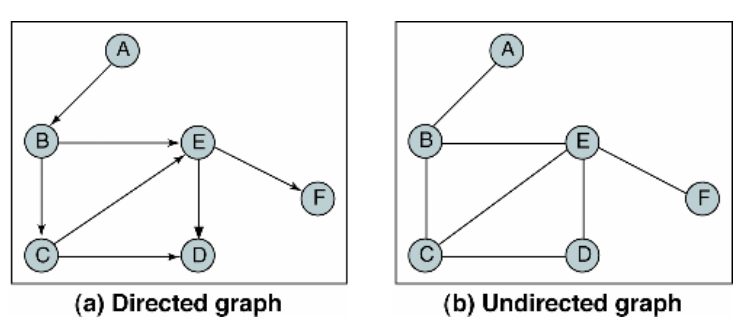
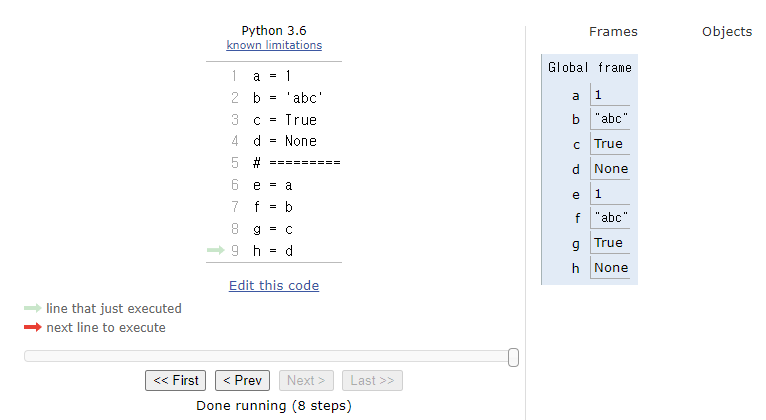
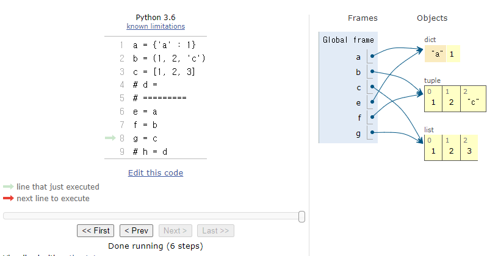

# 알고리즘 수업(5/10 days)
## 1. 이론 정리
1. Stack구조 : LIFO, append(), pop()
  후입선출 LIFO : last in first out
  (cf. FILO : first in last out)
  
  연산메서드 : push, pop
  push : 입력 : append
  pop : 마지막값 구조안에서 삭제하고 마지막 값을 출력합 : pop()
  ex) s = Stack()
  s.push(1)
  s.push(2)
  s.pop() -> 2
  s.pop() -> 1
  
  리스트의 append는 push와 같은 기능을 한다.
  ex) s = []
  s.append(1)
  s.append(2)
  s.append(3)
  s.pop() -> 3
  s.pop() -> 2
  s.pop() -> 1
2. Queue : 대기줄 : FIFO, append(), pop(0)
  실무에서는 Queue 대신에 deque를 사용한다.
  (deque : append(),pop(0))
  FIFO : 선입선출
  줄서기 : enqueue : append
  나가기: dequeue : pop(0)
  in : 1 -> 2 -> 3
  out : 1 -> 2-> 3
  FIFO를 할 경우 index가 변경됨.
  pop()을 할 경우에는 마지막값만 빠지고, 인덱스만 삭제하면 되나, pop(0)은 첫번째 값이 빠지고 유지되고 있는 **모든 항목의 index값이 변경**되므로 시간이 많이 걸림.
  
3. DFS(Depth First Search)  => 깊이 우선 탐색
  경우의 수 탐색
4. BFS(Breadth First Search) => 너비 우선 탐색
5. Graph : 관계
  * Node, Vertex(정점)
  * Edge(간선)
  
  * 그래프에는 방향이 있는 유향 (directed) 그래프와 방향이 없는 무향 (undirected) 그래프가 있다.
  
  * Graph 중에 Cycle이 없는 것을 **Tree**라고 부른다. Tree는 Graph의 하위 개념중 하나이다.
  * Graph의 표현(List, Dictionary, Matrix)
6. 변수 복사
  * 숫자, 문자, 참/거짓, None
    * 복사된 후 변수가 값을 따로 가짐
    * 
  * dict, list, tuple
    * 주소만 복사됨. 값 변경시에 원본과 복사본 모두 값이 바뀜.
    * 
## 2. 문제풀이(그래프)
1. URL : https://swexpertacademy.com/main/learn/course/lectureProblemViewer.do
2. 제목 : 그래프 경로
3. 문제 요약
  * V개의 노드, E개의 간선, 방향성 그래프
  * 특정 2개의 노드가 주어질 때 경로가 존재하면 1, 없으면 0 출력
  * [입력]
    * 첫줄 : 테스트개수 - T
    * 다음줄부터 V와 E 제고
    * 테스트 케이스의 둘째줄부터 E개에 줄에 걸쳐 간선정보가 주어진다.
    * E개 줄이 이후 출발노드 S와 도착노드 G가 주어진다.
4. 문제풀이(by teacher)
  * 방문여부를 체크하는 구문이 있어야 함. : visited
    * 무한 loop 또는 방문한 위치를 다시 방문하여 낭비임.
  * 목적지에서 마지막 위치를 pop한다.
  * pop된 정점을 방문체크한다.
  * 방문한 적이 없다면 pop 된 정점을 방문체크한다.
  * 현재 위치에서 갈 수 있는 정점들을 목적지에 추가한다.
  * **DFS 풀이**
```python
T = int(input())

for tc in range(1, T+1):
    V, E = map(int, input().split())
    # 빈 인접 리스트 그래프 생성
    graph = [[] for _ in range(V+1)]

    # 간선 입력
    for _ in range(E):
        start, end = map(int, input().split())
        graph[start].append(end)
        # 양방향(무향)그래프 일 경우 아래 줄 추가
        # graph[end].append(start)
    S, G = map(int, input().split())

    # S => G 로 갈 수 있는가?
    # DFS
    # 방문 여부
    visited = [False for _ in range(V+1)]
    # 목적지
    to_visits = [S]

    while to_visits:
        # 현재 위치 = 목적지들에서 마지막
        current = to_visits.pop()
        # 현재 위치를 방문한 적이 없다면,
        if not visited[current]:
            # 현재 위치 방문 체크
            visited[current] = True
            # 현재 위치에서 갈 수 있는 정점들을 목적지들에 추가
            to_visits += graph[current]

    print(f'#{tc} {int(visited[G])}')
```
  * **BFS 풀이 - 1**
    * pop() -> pop(0)로 바꾸어주면 DFS가 BFS가 됨
    * 목적지에 저장된 list의 앞부분이 최근에 이동할 수 있는 목적지였으므로, pop(0)가 BFS가 됨.
```python
# current = to_visits.pop()
# -> 
current = to_visits.pop(0)
```
* **BFS 풀이 - 2**
  * pop(0)를 쓰는 것은 index 변경이 생겨 좋은 code가 아님. 대신 **deque를 사용하여 풀이**함.
```python
# 목적지
# to_visits = [S] 
# ->
to_visits = deque()
to_visits.append(s)
# ...
current = to_visits.pop()
```
## 3. 문제풀이(송아지 찾기 - BFS문제)
1. 제목 : 송아지 찾기
2. 요약
   1. 현수는 송아지를 잃어버렸다.
   2. 송아지는 직선위치에 있으며 이동하지 않는다.
   3. 현수는 한번에 +1, -1, +5 만큼 이동할 수 있다.
   4. 최소한 몇 번을 이동해야 송아지 위치에 갈 수 있나?
   5. 현수의 출발지점 s, 송아지의 위치 e가 주어진다.
3. 풀이 by teacher
  * **최소한**의 경우의 수를 찾는 것이므로 BFS 문제이다.
  * 방문한 위치(visited)를 고려한다.
  * 문제 2풀이와 동일
## 4. 문제풀이(DFS, BFS 문제)
1. URL : https://www.acmicpc.net/problem/1260
2. 제목 : DFS와 BFS
3. 요약 : 그래프를 DFS로 탐색한 결과와 BFS로 탐색한 결과를 출력하는 프로그램을 작성하시오. 단, 방문할 수 있는 정점이 여러 개인 경우에는 정점 번호가 작은 것을 먼저 방문하고, 더 이상 방문할 수 있는 점이 없는 경우 종료한다. 정점 번호는 1번부터 N번까지이다.
4. 입력
   1. 첫째줄
      * 정점의 개수 N(1 <= N <= 1,000)
      * 간선의 개수 M(1 <= M <= 1,000)
      * 탐색을 시작할 정점의 번호 V
    2. 다음줄 M개의 줄에는 간선이 연결하는 두 정점의 번호가 주어진다.
    3. 간선은 양방향이다.
5. 출력
  * 첫째 줄에 DFS를 수행한 결과를, 그 다음 줄에는 BFS를 수행한 결과를 출력한다. V부터 방문된 점을 순서대로 출력하면 된다.
6. 풀이
7. 
