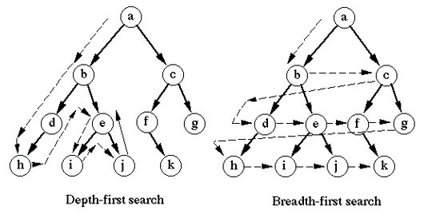

학습 url : https://swexpertacademy.com/main/learn/course/subjectDetail.do?courseId=AVuPDN86AAXw5UW6&subjectId=AWOVHzyqqe8DFAWg#

# 1. Stack 자료 구조의 개념
1. Stack : 물건을 쌓아 올리듯 자료를 쌓아 올린 형태의 자료구조
2. 선형구조를 가짐
  * 선형구조 : 자료간의 관계가 1대 1의 관계를 가짐
  * 비선형 자료구조 : 자료간의 관계가 1 대 N의 관계를 가짐(예: 트리)
3. 후입선출(LIFO : Last In First Out)
  ex) 1 -> 2-> 3-> 3 -> 2-> 1.
4. 연산
  * top : 스택에서 마지막 삽입된 원소의 위치
  * push : 삽입
  * pop : 삭제, 역순으로 꺼냄
  * isEmpty : 스택이 공백인지 아닌지를 확인하는 연산
  * peek : 스택의 top에 있는 item(원소)을 반환하는 연산
# 2. Stack의 응용
  * 괄호검사
    * 문자를 검색 후 '('가 있으면 stack에 쌓고, ')'가 있으면 pop실행
    * 문자를 검색이 끝낸 후 len()이 0인지 아닌지 확인
  * 재귀함수 호출
# 3. Memoization
 * 피보나치 수열
  * 0과 1로 시작하고, 이전의 두 수의 합을 다음 항으로 하는 수열
    * ex) 0, 1, 1, 2, 3, 5 ,8...
  * 피보나치 수열의 i번째 값을 계산하는 함수 F를 정의하면 아래와 같다.
    * F0 = 0, F1 = 1
    * Fi = F(i-1) + F(i-2) for i >= 2
  * 피보나치 수열은 정의가 자기자신으로 정의 되었기 때문에 **재귀함수**로 작성할 수 있다.
```python
def fibo(n):
  if n < 2:
    return n
  else:
    return fibo(n - 1) + fibo(n - 2)
```
  * 위와 같이 피보나치 수열을 재귀함수로 작성할 수 있으나, 많은 중복 호출이 발생함.
  * **Memoization**
    * **컴퓨터 프로그램을 실행할 때 이전에 계산한 값을 메모리에 저장해서 매번 다시 계산하지 않도록 하여 전체적인 실행속도를 빠르게 하는 기술**
  * Momoization이 적용된 피보나치 수열 함수
```python
# memo를 위한 리스트를 생성하고,
# momo[0]을 0으로 momo[1]는 1로 초기화 한다.
def fibo1(n):
  global mome
  if n >= 2 and len(memo) <= n:
    memo.append(fibo1(n-1) + fibo1(n-2))
  return memo[n]
memo = [0, 1]
```
# 4. DP(동적 계획법)
  * Dynamic Programming
    * 그리디 알고리즘과 같이 **최적화** 문제를 해결하는 알고리즘
    * 먼저 입력 크기가 작은 부분 문제들을 모두 해결한 후에 그 해들을 이용하여 보다 큰 크기의 부분 문제들을 해결하는 것이다.
```python
# 피보나치 수를 DP에 적용한 알고리즘
def fibo2(n):
  f = [0, 1]
  for i in range(2, n+1):
    f.append(f[i-1] + f[i-2])
  return f[n]
```
  * DP의 구현방식은 2가지로 구분할 수 있다.
    * recursive방식
      * 재귀적 구조는 내부에 시스템 호출 스택을 사용하는 **overhead**가 발생할 수 있다.
    * iterative방식
      * Memoization을 재귀적 구조에 사용하는 것보다 반복적 구조로 DP를 구현한 것이 **성능면에서 보다 효율적**이다.
# 5. DFS(깊이 우선 탐색)
  * 비선형구조인 그래프 구조는 그래프로 표현된 모든 자료를 빠짐없이 검색하는 것이 중요
  * 그래프 구조의 2가지 탐색방법
    * 깊이우선탐색(Depth First Search, DFS)
    * 너비우선탐색(Breadth First Search, BFS)
  * 
# 6. 문제풀이 - 종이붙이기
1. url : https://swexpertacademy.com/main/learn/course/subjectDetail.do?courseId=AVuPDN86AAXw5UW6&subjectId=AWOVHzyqqe8DFAWg
2. 요약
  * 가로x세로 길이가 10x20, 20x20인 직사각형 종이들이 있다.
  * 교실 바닥이 20xN 이며 빈틈없이 종이를 붙인다.
  * 10의 배수인 N이 주어졌을 경우, 종이를 붙이는 모든 경우의 수를 찾아라.
3. 입력
  * 첫줄 : Testcase : 1 <= T <= 50
  * 다음줄부터 10 <= N <= 300, N은 10의 배수
4. 풀이
  * ~~20x10, 20x20종이가 있지만, [20, 10], [20, 20], [10, 20] 3개의 종이가 있다고 먼저 선언한다.~~
  * ~~각 종이의 모두가 시작점 경우의 수를 구한다.~~
  * ~~각 종이의 첫번째가 20이면 옆으로 붙인다.~~
  * ~~각 종이의 두번재가 30이 될때 count += 1을 한다.~~
  * 풀이 by teacher
    * **패턴을 찾는 문제임**
    * n = 1, 2, 3, 4, 5, 6
    * answer = 1, 3, 5, ....
    * answer = f(n-1) + f(n-2) x 2 라는 패턴을 찾았어야 함..
    * 피보나치 수열에 적용했던 재귀함수 적용
    * Memoization 적용하여야함.


# 7. 문제풀이 - 괄호검사
1. url : https://swexpertacademy.com/main/learn/course/subjectDetail.do?courseId=AVuPDN86AAXw5UW6&subjectId=AWOVHzyqqe8DFAWg
2. 요약
  *  괄호 {}, ()가 제대로 짝을 이뤘는지 검사하는 프로그램 작성
  *  괄호가 정상이면 출력 1을 괄호의 짝이 맞지 않으면, 0출력
3. 입력
  * 첫 줄에 테스트 케이스 개수 T가 주어진다.  1≤T≤50
4. 풀이
  Stack으로 풀이함.
  열린 괄호가 있으면 Stack을 쌓음.
  닫힌 괄호와 pop이 같으면 계속 진행
  문자열이 끝날 때까지 괄호가 남아 있거나, 열린괄호와 닫힌 괄호의 크기가 다르면 0 출력

# 8. 문제풀이 - 반복문자 지우기
1. url : https://swexpertacademy.com/main/learn/course/subjectDetail.do?courseId=AVuPDN86AAXw5UW6&subjectId=AWOVHzyqqe8DFAWg
2. 요약
  * 연속된 중복된 문자 삭제 후 연속된 중복문자가 없으면 남은 문자 길이 출력

# 8. 문제풀이 - 그래프 경로
1. url : https://swexpertacademy.com/main/learn/course/subjectDetail.do?courseId=AVuPDN86AAXw5UW6&subjectId=AWOVHzyqqe8DFAWg
2. 요약
  * 경로가 주어짐
  * 시작점과 끝점이 주어지며 시작점과 끝점으로 갈 수 있는지 문는 문제
3. 풀이 by teacher
  * DFS로 풀이하면 됨.
  * DFS 재귀함수로 풀이하면 됨
  * `to_visite`라는 stack이 필요없이 재귀함수 자체가 stack 역활을 함.
4. 입력
  * 첫줄에 테스트 케이스 개수
  * 

# 9. 문제풀이 - 부분집합의 합
* 부분집합(2**n), 백트래킹, 상태공간트리, 가지치기전략
* 풀이: https://www.youtube.com/watch?v=bHLigtfhPbM
* 부분집합 : https://www.youtube.com/watch?v=b_LRHAB1Xh4
* bit로 부분 집합 : https://www.youtube.com/watch?v=b_LRHAB1Xh4
* 
1. url : 
