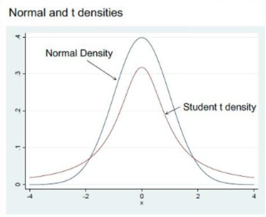
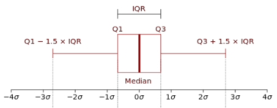

# 1. 알고리즘 문제풀이
1. 제목: 구슬 탈출2
2. url : https://www.acmicpc.net/problem/13460
3. 요약
  * 구슬 탈출은 직사각형 보드에 빨간 구슬과 파란 구슬을 하나씩 넣은 다음, 빨간 구슬을 구멍을 통해 빼내는 게임이다.
  * 보드 세로크기 : N, 가로크기 : M
  * 빨간구슬이 구멍에 빠지면 승리, 파란구슬이 구멍에 빠지면 실패
  * 빨간구슬과 파란구슬이 동시에 구멍에 빠져도 실패
  * 기울이는 동작을 그만하는 것은 더 이상 구슬이 움직이지 않을 때 까지이다.
4. 입출력
  * 입력
    * 첫째줄 세로, 가로크기 : N, M(3 <= N, M <=10)
    * 다음줄 N개의 줄 모양의 보드 모양 : '.', '#', 'O', 'R', 'B' 로 구성
    * '.'은 빈 칸
    * '#'은 공이 이동할 수 없는 장애물 또는 벽
    * 'O'는 구멍의 위치
    * 'R'은 빨간 구슬의 위치
    * 'B'는 파란 구슬의 위치
    * 입력되는 모든 보드의 가장자리에는 모두 '#'이 있다. 구멍의 개수는 한 개 이며, 빨간 구슬과 파란 구슬은 항상 1개가 주어진다.
  * 출력
    * 최소 몇 번 만에 빨간 구슬을 구멍을 통해 빼낼 수 있는지 출력한다. 
    * 만약, 10번 이하로 움직여서 빨간 구슬을 구멍을 통해 빼낼 수 없으면 -1을 출력한다.
5. 풀이
  * 빨간공이 움직일 수 있는 모든 항목에 대해 DFS(깊이탐색)을 하여 구멍으로 빠질 때의 경우의 수를 구한다.
  * 파란공이 빠질 때의 깊이 탐색은 제외한다.
  * 빨간공이 빠지더라도 파란공이 같이 빠진다면 그 깊이 탐색도 제외한다.
  * 모든 사항에 대해 깊이 탐색을 수행한 후 가장 작은 값을 선택한다.
6. code

# 2. 인공지능 기초(수업내용 요약)
## pandas

## 2. 기초통계
### 1. 기초통계
1. 데이터와 변수
  * 모집단으로부터 추출된 자료 -> 표본
    * 모집단 : 모수
    * 표본 : 통계량
  * 변수는 수치형, 범주형으로 분류할 수 있다.
    * 수치형 : 양적형.
      * 연속형
        * 비율형 : 신장, 체중, 매출액, 시청률
        * 등간형 : 온도 점수
      * 이산형
    * 범주형 : 질적형.
      * 순서형 : 비만도, 학점, 선호도
      * 명목형 : 성별, 혈액형
2. 분포
  * t-분포
    * 보통의 data는 정규분포를 따른다.
    * 다만, sampling data가 30개 이하라면 t-분포를 따른다.
      * t-분포 : 꼬리가 두껍고, 중앙값이 낮다.
      * 
* 통계량
  * 평균(mean)
    * 계산이 쉽고, 활용하기에 편리함.
    * 단점 : **극단값에 민감함.**
    * 종류 : 산술평균, 기하평균, 조화평균
  * 중앙값(median)
    * 데이터를 순서로대로 나열하여 중앙에 있는 값
    * 짝수개일 경우 : n/2번째와 (n+2)/2번째값의 평균사용
  * 최빈값(mode)
    * 자료에서 빈도가 가장많은 값
    * **자료에서 유일한 값이 아닐 수도 있다.**
  * 위치 통계량
    * 백분위수 : 100등분하여 순위
    * 사분위수 : 100분위수중 25번째 1사분위수 Q1, 그다음 25%부터 Q2, Q3, Q4
    * 상자-수염그림(boxplot)
      * 자료붙포의 특성을 그래프로 요약하는 방법
      * IQR은 이상치 판단에 사용됨.
        * IQR에서 1.5xIQR을 벗어나는 값을 이상치로 판단할 수 있음.
      * 
  * 범위 : 최대치와 최소값의 차이, 극단값에 영향을 크게 받음.
  * 분산 : 모든 편차를 제곱하고 이들을 합한 후 자료의 총수로 나눈 값
    * 주어진 자료가 평균 주위로 얼마나 떨어져 있는가를 측정
  * 표준편차 : 분산의 제곱근
    * 제곱근하여 raw data의 단위로 환산한 것
  * 변동계수 : 표준편차를 평균으로 나눈 값
    * 서로 다른 데이터 간의 편차를 비교하는 방법
  * 왜도 : 자료의 대칭성을 알아보는 측도
    * 정규분포에서 봉오리가 꼬리쪽으로 치우친 정도
    * 꼬리가 +쪽에 치우치면 +
    * 꼬리가 -쪽에 치우치면 -
  * 첨도 : 정규분포 대비 봉오리의 높이를 알아보는 측도
    * 정규분포보다 크면 첨도는 +
    * 정규분포보다 작으면 첨도는 -
### 2. 확률과 분포
1. 확률
  * 확률실험(E)
    * 예) 동전던지기
  * 확률은 0~1까지의 값을 가지며
  * 모든 사건의 확률의 합은 1
  * 표본공간(S) : 확률실험으로부터 출현 가능한 모든 결과들의 모임
  * 사건(event) : 기호 알파벳 대문자로 표기
    * 표본공간의 각 원소(출현 가능한 개별 결과)들의 부분집합
    * 표기 : 사건A, 사건B 등으로 표기
  * 사건의 연산
    * 합사건의 확률 : 합집합과 동일
      * P(AuB) = P(A) + P(B) - P(A^B)
    * 곱사건의 확률 : 교집합과 동일
      * P(A^B) = P(A) x P(B|A) = P(B) x P(A|B)
    * 여사건의 확률 : 여집합과 동일
      * P(A^c^) = 1 - P(A)
    * 배반사건 : 두 사건이 겹치는 부분이 없는 사건
    * 독립사건 : 두 사건 A와 B가 다음 중 하나를 만족시키면 서로 독립이라고 함.
      * 두사건이 서로 연관이 없음. 동시에 또는 각각 일어날수 있음.
      * P(A|B) = P(A)
      * P(A^B) = P(A) x P(B)
      * P(B|A) = P(B)
    * P(A|B)의 의미 : B사건이 일어난 후 A사건이 일어날 확률
  * 조건부 확률
    * 어떤 사건이 일어났다는 조건이 주어졌을 때 확률
    * A가 발생한 상황하에서 B가 발생할 확률
  * **베이즈 정리**
    * 전확률 공식
    * 사전확률, 사후확률
    * 참고 url : https://www.youtube.com/watch?v=Y4ecU7NkiEI
  * 확률변수 / 확률분포
  * 확률분포는 이산형 분포와 연속형 분포가 있다.
    * 이산형 분포
      * 베르누이 시행(실험)
        * 매 시행마다 아래 조건을 만족하는 실험
        * **'성공'** 또는 **'실패'** 오직 두가지 가능한 결과만 가짐
        * 성공의 확률이 p로 일정함
        * 예)
          * 동전던지기
          * 주사위 던지기
            * (1 : 성공, 2~6 : 실패) 또는 (1~3 : 성공, 4~6 : 실패) 등등
      * 포아송 분포
        * 일정한 단위시간, 단위거리, 단위면적과 같이 **어떤 단위구간**에서 **어떤 사건이 랜덤하게 발생**하는 경우에 사용할 수 있는 이산형 확률분포
        * 예)
          * 1시간 동안 은행에 방문하는 고객의 수
          * 1시간 동안 콜센터로 걸려오는 전화 수