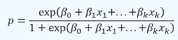
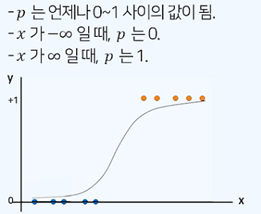

# ProDS
## 데이터 분석 이론(초급) 
### 29. 분류: 로지스틱 회귀(Logistic Regression)
* 분류 알고리즘
* 지도학습 알고리즘
* Y가 범주형
1. 로지스틱 회귀모형
  * 로지스틱 회귀분석은 선형 회귀분석과 달리 반응변수가 범주형 데이터인 경우에 사용되는 기법.
  * 새로운 설명변수의 값이 주어질 때 반응변수의 각 범주에 속할 확률이 얼마인지를 추정하고, 추정 확률을 분류기준값에 따라 분류하는 목적으로 사용됨.
2. 이항 로지스틱 회귀모형
  * 이진(0/1)형 값을 가지는 반응변수를 여러 설명변수를 이용하여 회귀식의 형태로 예측하는 모형.
  * 시그모이드 함수
    * 
      ```python
      import numpy as np

      def sigmoid(x):
          y_hat = 1 / (1 + np.exp(-x))
          return y_hat
      ```
  * 확률 p는 0 ~ 1 사이의 값을 가진다.
  * 로지스틱모형 그래프
    * 

### 30. 의사결정나무 모델: 분류 나무(Classification Tree)
1. 개요
   * 의사결정규칙을 나무 구조로 도표화하여 관심대상이 되는 집단을 몇 개의 소집단으로 분할하는 방식으로 분류 및 예측하는 분석 방법
     * 분류나무 : 범주형
     * 회귀나무 : 수치형
2. 구조
  * 뿌리마디(root node) : 시작되는 마디로 전체 자료로 구성됨.
  * 자식마디(child node) : 하나의 마디로부터 분리되어 나간 2개 이상의 마디들.
  * 부모마디(parent node) : 주어진 마디의 상위마디.
  * 끝마디(terminal node) : 자식마디가 없는 마디.
  * 중간마디(internal node) : 부모마디와 자식마디가 모두 있는 마디.
  * 깊이(depth) : 뿌리마디부터 끝마디까지 중간마디의 수.
3. 종류
  * 주요 알고리즘의 특징
  * .png)
4. 분석절차
  * 나무의 성장(growing)
  * 가지치기(pruning)
  * 타당성 평가
  * 해석 및 예측
5. 분리규칙 탐색
  * 불순도
    * 지니 불순도
    * 엔트로피 불순도
    * 불순도가 클수록 자식노드 내 이질성이 큼을 의미함. 불순도가 가장 작아지는 방향으로 가지 분할을 수행함.