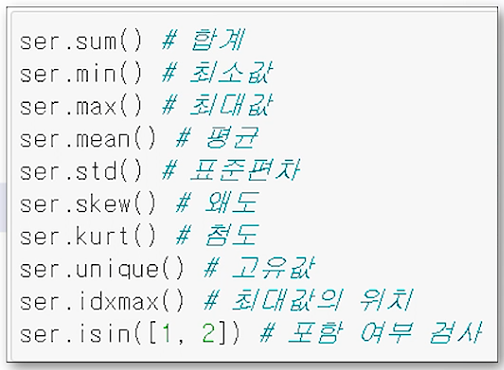

# ProDS
## 파이썬(Python)을 활용한 데이터 분석 실습(초급+중급)
### 3. 기본 문법 2
1. 제어문
  * if문
2. 사용자 정의 함수
  * def
3. 라이브러리
  * pandas, numpy

### 4. EDA: 수치형, 범주형 기술통계
1. NumPy 객체
2. Pandas 객체
  * 
  * DataFrame
  * crosstab
  * groupby

### 5. 표본 추출
1. 표본추출
  * 단순 임의 추출
  * 층화 표본 추출
  * 계통 추출
  * 군집 추출
2. 주요 함수 및 메서드 소개
  * pandas - sample()
    * 단순임의 추출을 수행하는 메서드
    * n : 표본 개수
    * frac : 비율
    * random_state : 표본 추출 결과를 고정
    * groupby() 메서드를 추가하면 층화 표본추출 가능
  * sklearn - train_test_split()
    * 입력데이터프레임이나 배열을 두 세트(학습, 평가)로 나누는 함수
    * train_size 또는 test_size : 개수 또는 비율을 입력하여 표본 개수 조절
    * random_state : 표본 추출 결과를 고정

### 6. 데이터 전처리: 결측치, 이상치
1. 이상치 : 중심 경향성에서 멀리 떨어진 값
  * 이상치처리 : Carling, Tukey 등의 방법이 있음.
2. 결측치 : 값이 기록되지 않고 비어 있음.
  * 결측치처리 : 단순제거와 즉정 값으로 대체하는 방식이 있음.
3. 주요 함수 및 메서드
  * pandas - isna(), isnull()
    * 결측치 원소를 True, 관측치를 False로 반환
    * 반대의 기능을 하는 메서드는 notna(), notnull()
  * pandas - fillna()
    * 결측치를 채워 넣기 위한 메서드
    * value인자에 결측치를 채워 넣을 값을 입력하며 **딕셔너리** 사용 가능
    * method에 'bfill'은 뒤의 값을 'ffill'은 앞의 값을 참고하여 결측 처리
  * pandas - dropna()
    * 결측치가 있는 row 또는 column을 제거
    * how인자 : 'any' - 결측치가 하나 이상인 경우 제거, 'all' - 전체가 결측치인 경우 제거
  * pandas - quantile()
    * 분위수를 연사하는 메서드로 이상치 필터링에 활용
    * q인자에 1개 이상의 확률값(0~1)을 입력하여 그에 맞는 분위수 산출 가능
