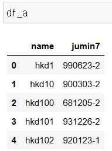
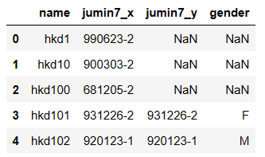
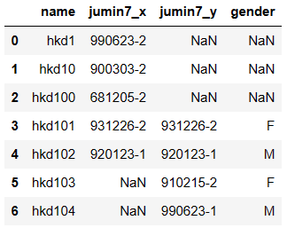

# 1. 인공지능 기초(수업내용 요약)
## 1. pandas
1. 결손데이터 처리하기(isna(), dropna(), fillna())
  * isna() : DataFrame에서 결손데이터를 'True'로 반환함.
    * ex) df_hk_na.isna()
    * True를 1로보고 연산이 됨 - sum을 사용하여 na항목을 찾을 수 있음.
      * column별로 na가 몇개 있는지 확인 가능
      * ex) df_hk_na.isna().sum()
  * dropna() : na항목 삭제
    * ex) df_hk_na.dropna()
    * 속성값
      * how='any' : 기본값, If any NA values are present, drop that row or column.
      * how='all' : If all values are NA, drop that row or column.
      * subset=['컬럼명'] : 해당 column에만 적용
        * ex) df_hk_na.dropna(subset=['age', 'blood_type'])
  * fillna() : na 대신 할 값을 채움
    * ex) df_hk_na.fillna(20) : na대신 20으로 변경한다.
    * ex) df_hk_na['blood_type'].fillna('K') : 'blood_type' column에 있는 na를 K로 변경한다.
2. sort, aggregation함수, groupby
  * sort_values : column정렬
    * ex) 1개 정렬 : df_hk.sort_values(by = 'age', ascending = False)
    * ex) 2개 정렬 : df_hk.sort_values(by = ['blood_type', 'age'], ascending = False)
    * ex) 개별 colum 정렬 : df_hk.sort_values(by = ['blood_type', 'age'], ascending = [True, False])
  * aggregation (집계함수)
    * ex) df_hk.mean() : 모든 수치형 항목에 대해 적용
    * ex) df_hk['age'].mean() : 단일 수치형 항목에 대해 적용
    * ex) df_hk[['age', 'salary']].mean() : 2개이상의 수치형 항목에 대해 적용
    * ex) df_hk[['age', 'salary']].agg(['mean', 'median', 'min', 'max', 'count']) : n개의 수치형 항목에 대해 여러개의 함수 적용
    * ex) df_hk[['age', 'salary']].agg({'age' : 'mean', 'salary' : 'median'}) : n개의 수치형 항목에 대해 개별 함수 적용
  * groupby()
    * ex) df_hk.groupby('company')['salary'].mean() : company별 salary를 평균함.
    * ex) df_hk.groupby('company')['salary'].count() : company별 salary를 count함.
  * groupby() + aggregation
    * ex) df_hk.groupby(['company', 'blood_type']).agg(['mean', 'max', 'median'])
      * company > blood_type으로 groupby한 후 모든 수치형 column에 대해 'mean', 'max', 'median'를 구하라.
    * ex) df_hk.groupby(['company', 'blood_type'])['age'].agg(['mean', 'max', 'median'])
      * company > blood_type으로 groupby한 후 age에 대해 'mean', 'max', 'median'를 구하라.
3. DataFrame의 병합 (join) : concat, merge
  * concat
    * concat (row), axis = 0 default 
      * ex) pd.concat([df_up,df_down]) : df_up아래에 df_down을 연속하여 붙임. axis = 0 기 기본이어서 안 써도 됨.
    * concat (column)  axis = 1
      * ex) pd.concat([df_left,df_right], axis = 1) : `axis = 1` 적용시에 오른쪽으로 DataFrame연결하여 붙임.
  * merge
    *  
    * 
    * merge (inner join default)
      * ex) pd.merge(left = df_a, right=df_b, left_on='name', right_on='name', how='inner')
        * name column에서 **중복되는 항목**만 DataFrame으로 생성
        * 
    * merge (left join)
      * ex) pd.merge(left = df_a, right=df_b, left_on='name', right_on='name', how='left')
        * name column에서 left는 그래도 두고 **중복되는 right 항목**을 붙여 DataFrame으로 생성
        * 
    * merge (outer join)
      * ex) pd.merge(left = df_a, right=df_b, left_on='name', right_on='name', how='outer')
        * name column에서 두개의 항목을 결합하여 DataFrame으로 생성
        * 
4. column내 값 변경 : replace, map
  * replace (1개 값 변경)
    * ex) df_hk['gender'].replace('F', 'female')
      * gender column에서 F -> female로 변경
  * replace (n개 값 변경) : 딕셔너리 표현 사용
    * ex) df_hk['gender'].replace({'F': 'female','M':'male'})
      * gender column에서 F -> female & M -> male로 변경
  * map (n개 값 변경)
    * ex) df_hk['gender'].map({'F': 'female','M':'male'})
      * gender column에서 F -> female & M -> male로 변경
5. apply lambda 식으로 데이터 가공
  * apply lambda
    * ex) df_hk['name'].apply(lambda x : x[3:])
      * name column의 모든 data의 3번째부터 출력 : hkd100	-> 100, hkd101 -> 101, ...
    * ex) df_hk['birth_day'] = df_hk['jumin7'].apply(lambda x : '19' + x[:6]).astype(int)
      * 19 + 6자리 -> 19xxxxxx로 작성(int)
    * ex) df_hk['birth_day'] = df_hk['jumin7'].apply(lambda x : '19' + x[:6]).astype('datetime64')
      * 19 + 6자리 -> 19xxxxxx로 작성(datetime64)
6. 값 등급화, 분류 : np.where, cut
  * np.where
    * 기본형 : np.where(조건, True, False)
    * ex) np.where(df_hk['age'] < 30, '30미만', '30이상')
    * np.where(조건1, True, np.where(조건2, True, False)
    * ex) np.where(df_hk['age'] < 30, '30미만', np.where(df_hk['age'] < 40, '40대', '50대 이상'))
  * cut
    * pd.cut(x = df_hk['age'], bins = [0,20,30,40,100], labels = ['10대', '20대', '30대', '40대이상'])
      * x column에 대해 bins로 분류한 후, lavels을 생성한다.
7. 날짜 변수 처리 (datetime)
  * datetime 모듈을 import해야 함.
    * import datetime
  * pd.to_datetime
    * %Y : 4자리사용
    * %y : 2자리사용
    * ex) df_hk['birth_day'] = pd.to_datetime(df_hk['jumin7'], format = '%y%m%d-%w')
  * datetime 활용
    * df_hk['birth_day'].dt.year
    * df_hk['birth_day'].dt.month
    * df_hk['birth_day'].dt.day
    * df_hk['birth_day'].dt.year
    * df_hk['birth_day'].dt.weekday # 월요일 : 0
    * df_hk['birth_day'].dt.day_name() # day_name은 ()주의

## 2. 기초통계
### 1. 기초통계
1. 데이터와 변수
  * 모집단으로부터 추출된 자료 -> 표본
    * 모집단 : 모수
    * 표본 : 통계량
  * 변수는 수치형, 범주형으로 분류할 수 있다.
    * 수치형 : 양적형.
      * 연속형
        * 비율형 : 신장, 체중, 매출액, 시청률
        * 등간형 : 온도 점수
      * 이산형
    * 범주형 : 질적형.
      * 순서형 : 비만도, 학점, 선호도
      * 명목형 : 성별, 혈액형
2. 분포
  * t-분포
    * 보통의 data는 정규분포를 따른다.
    * 다만, sampling data가 30개 이하라면 t-분포를 따른다.
      * t-분포 : 꼬리가 두껍고, 중앙값이 낮다.
      * 
* 통계량
  * 평균(mean)
    * 계산이 쉽고, 활용하기에 편리함.
    * 단점 : **극단값에 민감함.**
    * 종류 : 산술평균, 기하평균, 조화평균
  * 중앙값(median)
    * 데이터를 순서로대로 나열하여 중앙에 있는 값
    * 짝수개일 경우 : n/2번째와 (n+2)/2번째값의 평균사용
  * 최빈값(mode)
    * 자료에서 빈도가 가장많은 값
    * **자료에서 유일한 값이 아닐 수도 있다.**
  * 위치 통계량
    * 백분위수 : 100등분하여 순위
    * 사분위수 : 100분위수중 25번째 1사분위수 Q1, 그다음 25%부터 Q2, Q3, Q4
    * 상자-수염그림(boxplot)
      * 자료붙포의 특성을 그래프로 요약하는 방법
      * IQR은 이상치 판단에 사용됨.
        * IQR에서 1.5xIQR을 벗어나는 값을 이상치로 판단할 수 있음.
      * 
  * 범위 : 최대치와 최소값의 차이, 극단값에 영향을 크게 받음.
  * 분산 : 모든 편차를 제곱하고 이들을 합한 후 자료의 총수로 나눈 값
    * 주어진 자료가 평균 주위로 얼마나 떨어져 있는가를 측정
  * 표준편차 : 분산의 제곱근
    * 제곱근하여 raw data의 단위로 환산한 것
  * 변동계수 : 표준편차를 평균으로 나눈 값
    * 서로 다른 데이터 간의 편차를 비교하는 방법
  * 왜도 : 자료의 대칭성을 알아보는 측도
    * 정규분포에서 봉오리가 꼬리쪽으로 치우친 정도
    * 꼬리가 +쪽에 치우치면 +
    * 꼬리가 -쪽에 치우치면 -
  * 첨도 : 정규분포 대비 봉오리의 높이를 알아보는 측도
    * 정규분포보다 크면 첨도는 +
    * 정규분포보다 작으면 첨도는 -
### 2. 확률과 분포
1. 확률
  * 확률실험(E)
    * 예) 동전던지기
  * 확률은 0~1까지의 값을 가지며
  * 모든 사건의 확률의 합은 1
  * 표본공간(S) : 확률실험으로부터 출현 가능한 모든 결과들의 모임
  * 사건(event) : 기호 알파벳 대문자로 표기
    * 표본공간의 각 원소(출현 가능한 개별 결과)들의 부분집합
    * 표기 : 사건A, 사건B 등으로 표기
  * 사건의 연산
    * 합사건의 확률 : 합집합과 동일
      * P(AuB) = P(A) + P(B) - P(A^B)
    * 곱사건의 확률 : 교집합과 동일
      * P(A^B) = P(A) x P(B|A) = P(B) x P(A|B)
    * 여사건의 확률 : 여집합과 동일
      * P(A^c^) = 1 - P(A)
    * 배반사건 : 두 사건이 겹치는 부분이 없는 사건
    * 독립사건 : 두 사건 A와 B가 다음 중 하나를 만족시키면 서로 독립이라고 함.
      * 두사건이 서로 연관이 없음. 동시에 또는 각각 일어날수 있음.
      * P(A|B) = P(A)
      * P(A^B) = P(A) x P(B)
      * P(B|A) = P(B)
    * P(A|B)의 의미 : B사건이 일어난 후 A사건이 일어날 확률
  * 조건부 확률
    * 어떤 사건이 일어났다는 조건이 주어졌을 때 확률
    * A가 발생한 상황하에서 B가 발생할 확률
  * **베이즈 정리**
    * 전확률 공식
    * 사전확률, 사후확률
    * 참고 url : https://www.youtube.com/watch?v=Y4ecU7NkiEI
  * 확률변수 / 확률분포
  * 확률분포는 이산형 분포와 연속형 분포가 있다.
    * 이산형 분포
      * 베르누이 시행(실험)
        * 매 시행마다 아래 조건을 만족하는 실험
        * **'성공'** 또는 **'실패'** 오직 두가지 가능한 결과만 가짐
        * 성공의 확률이 p로 일정함
        * 예)
          * 동전던지기
          * 주사위 던지기
            * (1 : 성공, 2~6 : 실패) 또는 (1~3 : 성공, 4~6 : 실패) 등등
      * 포아송 분포
        * 일정한 단위시간, 단위거리, 단위면적과 같이 **어떤 단위구간**에서 **어떤 사건이 랜덤하게 발생**하는 경우에 사용할 수 있는 이산형 확률분포
        * 예)
          * 1시간 동안 은행에 방문하는 고객의 수
          * 1시간 동안 콜센터로 걸려오는 전화 수