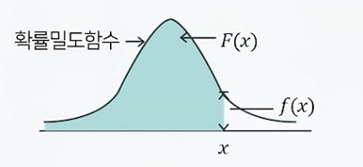

# ProDS
## 데이터 분석 이론(초급) 
### 3. 확률변수와 확률분포, 분포의 특성치
* 확률변수 : 표본공간에서 정의된 실수값 함수.
  1. 이산형 확률변수 : 확률변수가 취할 수 있는 값이 셀 수 있는 경우
    * ex) 고객, 사고건수, 불량수
  2. 연속형 확률변수 : 주어진 구간에서 모든 실 수 값을 취할 수 있어 셀 수 없는 경우
    * ex) 시간, 길이, 온도, 무게
* 확률분포
  * 확률분포함수는 이산형 -> 확률질량함수, 연속형 -> 확률밀도함수로 각각 적용된다.
  * 확률질량함수
    * 확률변수 X가 이산형인 경우 X가 취할 수 있는 값 x1, x2,.. xn의 각각에 대해 확률 P[X = x1], P[X = x2],..., P[X = xn],을 대응시켜주는 관계를 확률질량함수라고 하며 f(x)로 표기한다.
    * 확률질량함수의 성질
      1. 모든 i= 1,2,...,n에 대해 0 <= f(xi) <= 1
      2. $\sum_{i=1}^{n} f(x_i)$ = 1
  * 확률밀도함수
    * 확률변수 X가 연속형인 경우 X가 가질 수 있는 구간($-\infty, \infty$) 위에서의 함수 f(x)가 다음을 만족할 때 이를 X의 밀도함수라고 함.
    * $\int_a^b f(x) \mathrm{d}x$ = P[a <= X <= b] (단, $-\infty < a < b < \infty$)
    * 확률밀도함수의 성질
      1. 모든 a, b에 대해 0 <= $\int_a^b f(x) \mathrm{d}x$ <= 1
      2. $\int_a^b f(x) \mathrm{d}x$ = 1(단, a = $-\infty$, b = $\infty$)
  * 누적분포함수
    * X의 확률밀도함수가 f(x)일때, X의 누적분포함수 F(x)는 X <= x인 모든 X에 대한 f(x)의 적분값이 됨.
    * 
    * F($-\infty$) = 0, F($\infty$) = 1
    * x가 증가할 때 F(x)도 증가하며, F(x)는 음의 값을 가질 수 없음.
* 확률분포의 특성치
  * 기대값 : 분포의 **무게중심, 중심위치**를 나타냄.
    * E[X] = $\mu$ 
  * 분산 : 분포의 산포를 나타냄
    * V[X] = $\sigma^2$ = E[(X - $\mu$)^2^]
  * 표준편차 : 분산의 제곱근, 단위가 보정됨
    * S[X] = $\sigma$ = $\sqrt{V[X]}$

### 4. 이항분포, 포아송분포, 지수분포, 감마분포
1. 이항분포 - 이산형
   * 베르누이 시행
     * 매 시행마다, 성공 또는 실패 두가지 결과만 가짐
     * ex) 동전던지기
   * 이항확률변수가 고려되는 실험
     * 성공, 실패 2가지 가능성만 가지는 베르누이 시행을 독립적으로 n번 반복하는 실험
   * 이항확률변수와 확률질량함수
     * X : n번 시행중 '성공'의 횟수로정의
     * x : 1,2,3,...n의 값을 가짐
     * p : 한번의 실험에서의 성공의 확률
     * f(x) = P(X=n) = X~Bin[n,p]
   * 이항분포의 특성치
     * X~Bin[n,p] 인 경우
       * E[X] = np (기대값)
       * V[X] = np(1-p) (분산)
2. 포아송분포 - 이산형
   * 단위시간, 부피, 공간에서 우리가 생각하고 있는 사건의 발생가능성이 희박한 사건에 발생횟수를 모델링하는 경우에 사용함.
   * 단위시간(t=1), 포아송 확률과정을 따르는 사건 A가 발생하는 횟수를 X로 정의하면,
     f(x) = P(X=x) = $\frac{exp(-m)m^x}{x!}$, x= 0, 1, 2, 3,...
     이 경우 X~POI[m]라고 함.
     m = 단위시간에 1번 발생할 확률
   * 포아송분포의 특성치
     * X~POI[m] 인 경우
       * E[X] = V[X] = m
3. 지수분포 - 연속형
   * 내가 관심이 있는 사건이 발생할 때까지 걸리는 시간을 모델링하기 위해 활용되는 분포
   * 지수확률변수와 확률밀도함수
     * 단위구간에서 평균발행횟수가 m인 포아송 확률과정을 따르는 사건 A가 한번 일어난 뒤 그 다음 또 일어날 때까지 걸리는 시간 W로 정의됨.
       * f(x) = $\frac{1}{\lambda}exp\left(-\frac{1}{\lambda}\right)$ , x > 0. (단, m=$\frac{1}{\lambda}$ )
     * 이 경우 X~EXP[$\lambda$]라고 함.
   * 지수분포의 특성치
     * 포아송 모수와 지수 모수는 역의 관계
       * 단위구간 내 평균발생횟수가 m인 포아속 과정을 따르는 사건은 사건사이 소요시간의 평균이 $\lambda = \frac{1}{m}$임.
4. 감마분포 - 연속형
   * k번째 사건이 발생할 때까지 걸리는 시간등을 모델링하기 위해 활용하는 분포이다.
   * 감마확률변수 X의 확률밀도함수는 양수인 $\theta$와 k에 대하여 다음과 같이 정의됨.
   * f(x) = $\frac{1}{\theta^k*\gamma(k)}$x^k-1^$exp\left(-\frac{x}{\theta}\right)$
   * 이 경우 X~GAMMA[k,$\theta$]
   * 감마분포의 특성치
     * X~GAMMA[k,$\theta$] 인 경우
       * E[X] = k$\theta$ (기대값)
       * V[X] = k$\theta^2$ (분산)