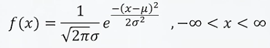
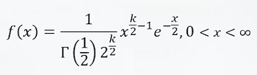
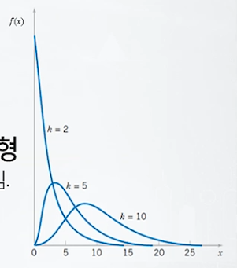
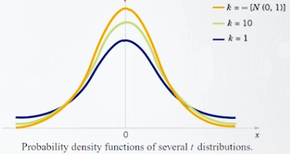
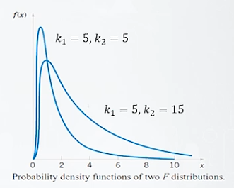
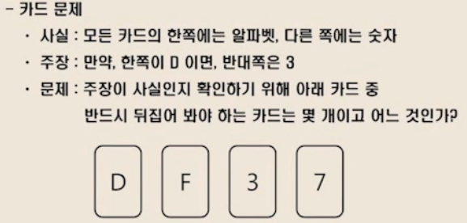

# ProDS
## 데이터 분석 이론(초급) 
### 5. 정규분포, 표준정규분포
1. 정규분포 - 연속형
  * 정의 : 확률변수 X가 평균 $\mu$, 분산이 $\sigma^2$이고, 다음의 확률밀도함수를 가질 때, X는 정규분포를 따른다고 함다.
  * 
  * X~N[$\mu,\sigma^2$]
  * $\mu$는 분포의 중심
  * $\mu$를 중심으로 대칭이고, $\mu$에서 가장 큰 값이 되는 하나의 봉우리만 가짐.
  * $\sigma^2$이 크면 분포의 산포가 커지고, $\sigma^2$이 작으면 분포의 산포가 작아짐.
  * 정규분포의 특성치
    * E[X] = $\mu$ (기대값, 평균)
    * V[X] = $\sigma^2$ (분산)
    * S[X] = $\sigma$ (표준편차)
2. 표준정규분포
  * 정의 : 알파벳 Z로 표기되며, $\mu$가 0이고 $\sigma$가 1인 정규분포이다.
  * X~N[$\mu$, $\sigma^2$]일 때, 정규분포의 선형불변성에의행 $Z=\frac{X-\mu}{\sigma}$~N[0,1]이 되며, 이때의 **평균이 0 분산이 1**인 정규분포를 표준정규분포라고 한다.
  * 표준정규분포와 정규확률변수의 표준화
    * 예)
      * X~N[10, 2^2^]일 때, P(10 < X < 13)
      * P(10 < X < 13)
        = P$\left(\frac{10-10}{2} < \frac{X-10}{2} < \frac{13-10}{2} < \right)$
        = P(0 < Z < 1.5), Z~N[0,1]
  * 표준정규 확률변수의 (1-$\alpha$)분위수 : Z$_\alpha$
  * Z~0.05~ = 1.645
  * Z~0.95~ = -1.645
  * Z~0.025~ = 1.96
  * Z~0.975~ = -1.96

### 6. 카이제곱분포, t분포, F분포
1. 카이제곱분포
  * 서로 독립인 표준정규가 제곱해서 더해진 **제곱합**들은 표준정규가 나올 때마다 각각 다른 값이 되는데 그 값들의 분포로 정의된다.
  * Z~1~, Z~2~,..., Z~k~가 k개의 서로 독립인 표준정규 확률변수(Z~i~ ~ N[0,1], i = 1,2,...,k)라고 할 때, X= Z~1~^2^ + Z~2~^2^ + ... + Z~k~^2^가 따르는 분포를 자유도가 k인 카이제고분포라고 한다.
  * 
  * 이경우 X~$\chi$^2^[k]라고 함.
  * 자유도 = k
    * 분포는 정규분포를 따르며, 정규분포의 값을 제곱하면 되므로 k값만 정해진다면, 카아제곱분포를 알 수있다.
  * 대표적으로 카이제곱분포는 **오른쪽으로 꼬리가 긴분포**를 가진다.
  * 카이제곱분포의 특성치
    * E[X] = k (기대값, 평균)
    * V[X] = 2k (분산)
  * 
  * 자유도 k가 커질수로 무게중심 E가 오른쪽으로 이동, 산포도 증가한다.
  * 카이제곱분포 확률변수의 (1-$\alpha$)분위수 : $\chi$^2^$_\alpha$~,k~
2. t분포
  * 독립인 정규를 따르는 분포들의 평균에 관한 분포로 활용된다.
  * Z가 표준정규 확률변수 Z~N[0,1]이며, U가 자유도가 k인 카이제곱 확률변수 U~$\chi^2$[k]이며, Z와 X는 서로 독립이라고 할 때, X = $\frac{Z}{\sqrt{U/k}}$가 따르는 분포를 자유도가 k인 t분포라고 정의함.
  * 이경우 X~t[k]라고 함.
  * t분포의 특성치
    * E[X] = 0 (기대값, 평균) : 0을 중심으로 대칭인 분포임을 의미함. 표준정규분포와 동일
    * V[X] = $\frac{k}{k-2}$ (단, k > 2) (분산)
      * 자유도 k가 매우 커지면, V는 1에 수렴하며 이 때는 표준정규분포와 동일하다고 할 수 있다.
  * t분포 확률밀도함수의 개형
    * 가운데 0을 중심으로 대칭인 종모양의 분포
    * 표준정규분포 보다 **꼬리가 두꺼움**.
    * 자유도 k가 커짐에 따라 산포가 줄어들어 표준정규분포로 수렴함.
    * 
3. F분포
  * 2개의 카이제곱 U, V가 있다. U가 자유도 k~1~인 카이제곱확률변수 U~$\chi^2[k_1]$이며, V가 자유도 k~2~인 카이제곱확률변수 U~$\chi^2[k_2]$이고, U와 V가 독립이라고 할 때, X = $\frac{U/k_1}{V/k_2}$가 따르는 분포를 자유도 k~1~, k~2~인 F분포라고 정의함.
  * 이 경우 X~F$[k_1, k_2]$ 라고 함.
  * F분포 확률밀도함수의 개형
    * 카이제곱처럼 오른쪽으로 치우친 비대칭 구조임.
    * 

# Algorithm_slove
1. Computational Thinking
  * 프로그래밍과 논리 / 수학
    * 논리 문제
    * 
    * 정답 : D와 7카드 2장 : **7뒤에 D**가 있는지 확인해야 함.