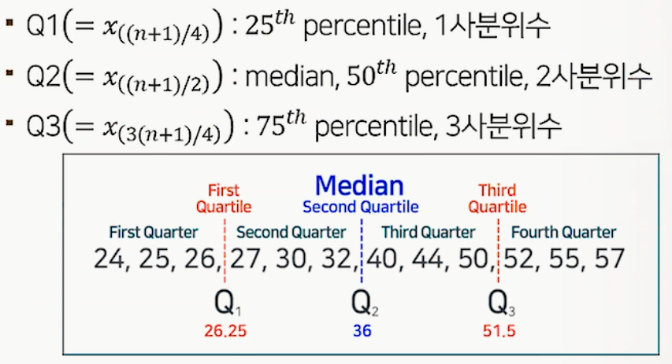

# ProDS
## 데이터 분석 이론(초급) 
### 7. 그래프에 의한 기술통계
* 질적자료인 경우 => 범주형
  * 정의 : 문자나 말로 표현되는 것
  * 구분
    * 명목형 : 순서가 없음. ex) 성별, 직업 등
    * 순서형 : 순서가 있음. ex) 옷의 사이즈
  * 변수의 개수에 따라 구분
    * 1개 변수 : 바차트(막대그림), 파이차트
    * 2개 변수 : 히트맵, 스택컬럼차트
* 양적자료인 경우
  * 정의 : 숫자로 표현되고 양의 많고 적음을 표현할 수 있는 것
  * 구분
    * 이산형 : 셀수 있음.
    * 연속형 : 무수히 많음.
  * 변수의 개수에 따라 구분
    * 1개 변수 : 히스토그램, 박스플롯(상자그림), 라인차트, QQ플롯
    * 2개 변수 : 산점도

### 8. 수치적 기술통계 ① 변동성
1. 중심 위치 척도
  * 평균(Mean)
    * 단점 : 이상치에 민감함.
  * 중위수, 중앙값(Median)
    * 표본자료를 오름차순으로 정렬하여 가운데 있는 값을 선정
  * 최빈값(Mode)
    * 가장 빈도가 높은 값 또는 구간
  * 
2. 상대적 위치 척도
  * 사분위수(Quartile) : Q1, Q2, Q3
    * Q2는 Median과 동일
    * 
3. 변동성 척도
  * 범위(Range)
    * max(x) - min(x)
  * 사분위간 범위(IQR, Inter Quartile Range)
    * Q3 - Q1
  * 표본 분산(Sample Variance)
    * 
  * 표본 표준편차(Sample Standard Deviation)
    * s = $\sqrt{s^2}$
    * 단위가 분산에서는 제곱이 되어 단위도 변경되었다.
    * 편차에서 원래단위로 바꿔주기 위해 제곱근을 해준다. 이 경우 해석이 용이해 진다.
  * 변동계수(Coefficient of Variation)
    * 평균대비 표준편차가 몇배인지 나타내는 지표이다.
    * 자료의 스케일 또는 단위가 다를 때 비교하는 지표이다.
    * cv = s/x (s : 표준편차, x : 평균)
4. 형태 척도
  * 분포의 형태에 관한 척도
    * 왜도 : 분포의 비대칭 정도를 나타내는 척도
    * 첨도 : 분포의 중심에서 뾰족함 정도를 나타내는 척도
    * 

### 9. 수치적 기술통계 ② 연관성
1. 두 숫자형 변수의 선형적 연관성
  * 방향 : 양과 음의 선형관계를 가진다.
  * 강도 : 강 또는 약
2. 표본 공분산(Sample Covariance)
  * 선형관계
    * s~xy~ > 0 : 양의 선형 관계, 비례관계
    * s~xy~ < 0 : 음의 선형 관계, 반비례관계
    * s~xy~ = 0 : 0에 가까울 수록 선형관계를 가지지 않는다.
  * 강도
    * -s~x~s~y~ <= s~xy~ <= s~x~s~y~
    * 단점, 공분산은 단위가 변화면 값의 변동이 큼.
3. 표본 상관계수(Sample Correlation, 피어슨 상관계수)
  * 공분산의 단점을 보완한 지표(측정단위에 의존하지 않음.)
  * -1 <= r~xy~ <= 1 사이의 값을 가짐.
  * 선형관계의 방향
    * r~xy~ > 0 : 양의 선형관계
    * r~xy~ < 0 : 음의 선형관계
  * 선형관계의 강도
    * |r~xy~| = 0 : 강도가 약함
    * |r~xy~| = 1 : 강도가 강함
4. 순위를 이용한 상관계수
  * 스피어만 상관계수
    * 원 자료값의 순위를 구한 뒤, 순위에 대하여 피어슨 상관계수를 구한 것.
    * -1에서 1사이의 값을 가지며, 절대값이 클수록 강한 상관관계를 나타냄.
  * 켄달의 상관계수
    * 두 변수 순위의 일치 정도를 측정.
    * 한 변수의 순위가 증가할 때 다른 변수의 순위도 함께 증가하는 경우(**부합**)가 그렇지 않은 경우(**비부합**)에 비해 얼마나 큰지를 측정하는 방식.
    * -1에서 1사이의 값을 가진다.

### 10. 통계적 추론 개요, 표본추출법
* 모수 : 모집단의 특성치
* 통계량 : 표본의 특성치
* 오차 : 모집단과 표본의 차이

|모수 |통계량 |
|---- |----   |
|$\mu$|$\overline{X}$|
|$\sigma^2$|$S^2$|
|$\sigma$|$S$|

* 표본추출방법 4가지
  * 모집단을 대표할 수 있도록 표본을 추출하는 것이 중요함.
  1. 단순임의 추출법(Simple random sampling)
    * 모집단을 구성하는 모든 원소에 대해 표본으로 추출될 확률을 동일하게 해주는 표본 추출법
    * n개의 번호를 임의로 선택하여 그 번호에 해당하는 원소를 표본으로 추출함.
  2. 계통 추출법(systematic sampling)
    * 모집단에 1,2,...N까지 번호를 부여하고, n개의 구간으로 나누어 각 구간에서 1개씩 임으로 선택하여 표본 추출함.
    * 단점 : 주기를 가지는 표본에는 적당하지 않음.
  3. 집락 추출법(cluster sampling)
    * 모집단이 몇개의 집락(cluster)이 결합된 형태로 구성되어 있고, 각집락이 모집단의 특성을 반영하고 있음.
  4. 층화 추출법(stratified sampling)
    * 이질적인 모집단의 원소들을 서로 유사한 것끼리 몇 개의 층으로 나눈 후 각 층에서 표본을 랜덤하게 추출함.

### 11. 점추정과 구간추정
* 추정량 : 모수 $\theta$의 추정에 사용되는 통계량을 $\theta$의 **추정량**($\hat{\theta}$)이라고 함. 관찰된 표본자료로 추정량의 값을 계산한 것을 추정치라고 함.
* 점추정(point estimation) : 하나의 모수를 한 개의 값으로 추정
* 구간추정(interval extimation) : 모수가 포함되리라 기대되는 구간으로 모수를 추정.
* 신뢰구간의 정의
  * $\theta$의 추정량이 $\hat{\theta}$을 적절하게 변형한 L과 U이 있어 다음을 만족하는 경우,
    * P[L <= $\theta$ <= U] = 1 - $\alpha$, 0 <= $\alpha$ <= 1
  * 구간 (L, U)을 $\theta$의 100(1-$\alpha$)% 신뢰구간이라고 함.
* 신뢰구간의 해석
  * $\mu$에 관한 추정에서 신뢰수준 90%의 의미는 n개의 표본을 추출하는 과정을 반복하여 매번 이 구간 추정식으로 신뢰구간을 계산한다면, 이들 중 90%에 해당하는 신뢰구간들이 참값 $\mu$를 포함하는 것을 의미.
  * n개의표본으로 구한 하나의 신뢰구간에 모수가 포함되었는지 여부는 알 수 없음.

