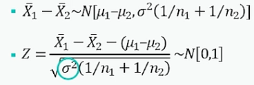
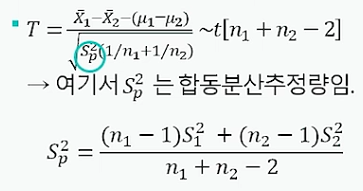
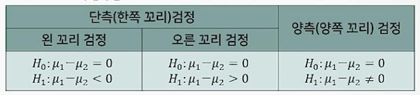
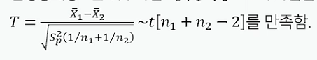

# ProDS
## 데이터 분석 이론(초급) 
### 14. 모평균 비교에 관한 가설검정(independent two sample t test)
* 두 모집단의 모평균($\mu_1 - \mu_2$) 차이
  * 모평균 비교를 위한 기본 가정 3가지
    * 독립인 두 표본
    * 등분산 가정 : $\sigma_1^2$ = $\sigma_2^2$ = $\sigma^2$
      * 두 그룹의 분산이 같다는 의미임.
    * 정규 모집단.
  * $\theta = \mu_1 - \mu_2$에 관한 추론 -> 추정량($\hat{\theta} = \overline{X_1} - \overline{X_2}$)의 표본분포를 이용.
  * 추정량($\hat{\theta} = \overline{X_1} - \overline{X_2}$)의 표본분포
    * 두 모집단이 정규분포이고, 모분산 $\sigma^2$이 알려지지 않았지만 동일한 것으로 가정. 두 표본은 독립.
    * 
    * 두 모집단이 정규분포이므로 표준정규분포로 변환이 가능하나, $\sigma^2$을 모르므로 아래와 같이 추정해야한다.
    * 
* 가설모형
  * 
* 검정통계량
  * 검정통계량 T는 귀무가설 H~0~ : $\mu_1 - \mu_2 = 0$이 사실일 때,
  * 
* 유의확률(p-value)의 계산
  * 귀무가서 H~0~가 사실일때,
  * 검정통계량 T의 분포 T에서 t~0~(=표본 자료로부터 계산된 검정통계량의 값)보다 대립가설 방향으로 더 극단적인 값이 나올 확률
  * 자료로부터 계산된 유의확률(p-value)이 주어진 유의수준 $\alpha$보다 작은 경우에 귀무가설 H~0~를 기각함.
  * p-value <= $\alpha$면, H~0~를 기각.

