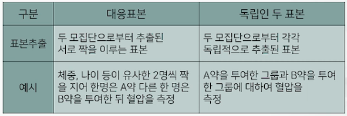
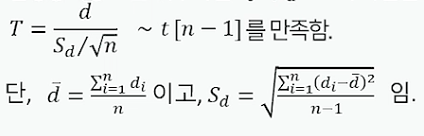
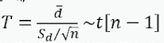
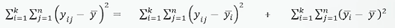
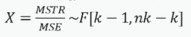
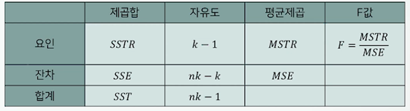

# ProDS
## 데이터 분석 이론(초급) 
### 15. 모평균 비교에 관한 가설검정(paired t test)
* 두개의 t-검정 비교
  * 독립 이표본 t-검정 : 두 그룹에서 추출된 표본들이 서로 완전히 무관한 상태라 가정
  * 쌍체 t-검정 : 두 그룹에서 관찰한 표본들이 서로 짝지어져 있는 상태
1. 대응표본에서 모평균 비교
  * 대응표본
    * 대응표본과 독인인 두 표본의 차이 비교
    * 
2. 검정통계량과 표본분포
  * 대응표본간 차이 d~1~, d~2~,..., d~n~이 분산이 알려지지 않은 정규분포를 따른다고 가정.
  * 검정통계량 T는 귀무가설 H~0~ : $\mu_d=0$ 이 사실일 때,
    * 
3. 유의확률(p-value)의 계산
  * 귀무가설 H~0~가 사실일 때, 검정통계량 T의 분포 에서, t~0~(=표본 자료로부터 계산된 검정통계량의 값)보다 대립가설방향으로 더 극단적인 값이 나올 확률.
  * 자료로부터 계산된 유의확률(p-value)이 주어진 유의수준 $\alpha$보다 작은 경우에 귀무가설 H~0~를 기각함.
  * p-value <= $\alpha$면, H~0~를 기각.

### 16. 모평균 비교에 관한 가설검정(One way ANOVA 및 사후검정)
* ANOVA 검정 : 분산분석, 평균비교에 관한 검정
* ANOVA 검정 후 : ANOVA 검정의 결과를 통해서 어떤 모평균의 차이가 있는가 사후적으로 검정하는 방법
1. 분산분석의 개요
  * 분산분석(Anlysis of Variance, ANOVA)
    * 정의
      * 2개 이상의 모집단의 모평균의 차이를 검정. 
      * 평균차이를 파악하기 위해 변동성을 이용 : 그룹별 평균이 다르면 그룹 별 평균의 변동성이 크다는 사실을 이용함.
    * 용어
      * 요인(factor) : 모집단(그룹)의 구분기준.
      * 처리(treatment(level)) : 요인을 구성하는 각 모집단(그룹)
2. 일원분산분석(One Way ANOVA)
  * 일원배치 자료의 구조
    * 1개의 요인에 대해 k개의 처리(그룹)로 분류되어 있는 자료.
  * 일원배치 분산분석 가정
    * 정규, 등분산, 독립.
    * 1개의 요인에 대해 k개의 처리(그룹)로 분류되어 있는 자료.
    * k개의 모평균 $\mu_1, \mu_2,...\mu_k$이 모두 동일한지 아닌지를 검정하고자 함.
  * 제곱합의 분해
    * 
    * 총변동성(SST) = 오차에의한 변동(SSE) + 요인에 의한 변동(SSTR)
    * 총변동성(SST) = 그룹내 변동 + 그룹간 변동
    * 총변동성(SST) : 그룹에 무관한전체 자료의 변동을 측정.
    * 오차에의한 변동(SSE) : 각 그룹 내에서의 변동을 측정.
    * 요인에 의한 변동(SSTR) : 각 그룹 별 평균의 변동을 측정.
      * SSTR의 크기로 집단별 모평균 차이를 파악할 수 있음.
3. One way ANOVA 검정절차
  * 가설
    * 귀무가설 H~0~ : 집단 간 평균의 차이가 없음.
      * $\mu_1 = \mu_2 = ... = \mu_k$
    * 대립가설 H~1~ : 집단 간 평균의 차이가 존재함.(해당 요인의 처리 효과 있음)
  * 검정 통계량
    * 평균제곱 : 제곱합들을 각각의 자유도로 나눈 값.
      * MSTR = SSTR / (k-1), MSE = SSE / (nk - k)
    * 만일 그룹별 모평균이 같다면, MSTR $\approx$ MSE
    * 만일 그룹별 모평균이 모두 같지 않다면 MSTR >> MSE
    * 귀무가설(H~0~)이 사실인 경우,
      * 
  * 유의확률(p-value)의 계산
    * 귀무가설 H~0~가 사실일 때,
    * 검정통계량 X의 분포  에서,
    * x~0~(=표본 자료로부터 계산된 검정통계량의 값)보다 더 큰 값이 나올 확률.
  * 검정법
    * 자료로부터 계산된 유의확률(p-value)이 주어진 유의수준 $\alpha$보다 작은 경우에 귀무가설 H~0~를 기각함.
    * p-value <= $\alpha$면, H~0~를 기각함.
      * **항상 오른꼬리 이용한 p-value를 계산함.**
    * 분산분석표
      * 
  * 사후검정
    * 분산분석은 모든 집단의 모평균이 동일한지, 하나 이상의 집단에서 모평균의 차이가 나는지에 대해서만 파악함.
    * 따라서 집단 별 차이가 존재하는 것으로 결론이 나더라도 어느 집단에서 차이가 발생하는지는 알 수없음.
    * 사후검정을 통해 어떤 집단에서 차이가 발생하는지를 확인할 수 있음.
