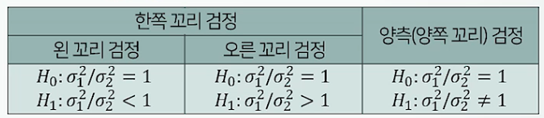

# ProDS
## 데이터 분석 이론(초급) 
### 17. 모분산 비교에 관한 가설검정(F-test of equality of variances)
* 모분산 2개에 대한 가설검정
1. 두 모집단의 모분산($\sigma_1^2$/$\sigma_2^2$)차이
  * 독립인 두 표본
  * $\theta = \sigma_1^2 / \sigma_2^2$에 관한 추론
   -> 추정량($\hat{\theta} = S_1^2 / S_2^2$)의 표본분포를 이용.
  X = $\left(\frac{\sigma_2^2}{\sigma_1^2}\right)$*$\left(\frac{S_1^2}{S_2^2}\right)$ ~ F[$n_1$ - 1, $n_2$ - 2]
2. 모분산 비교에 관한 가설검정(F test of equality of variances)
  * 가설유형
    * 관심모수가 $\sigma_1^2 / \sigma_2^2$이고, 검정하고자 하는 모수의 경계값은 1이 되므로,
    * 
  * 검정통계량
    * 두 모집단이 모두 정규분포인 경우
    * 다음의 검정통계량 X는 귀무가설 $H_0 : \sigma_1^2 / \sigma_2^2 = 1$일 때,
    * 1*$\left(\frac{S_1^2}{S_2^2}\right)$ ~ F[$n_1$ - 1, $n_2$ - 2]
  * 유의확률(p-value)의 계산
    * 귀무가설 H~0~가 사실일 때,
    * 검정통계량 X의 분포 분포 X = $\left(\frac{S_1^2}{S_2^2}\right)$ ~ F[$n_1$ - 1, $n_2$ - 2]에서, x~0~(표본자료로부터 계산된 검정통계량의 값)보다 대립가설 방향으로 더 극단적인 값이 나올 확률.
  * 유의수준(significance level) 100 $\alpha$%검정법
    * 자료로부터 계산된 유의확률이 주어진 유의수준 $\alpha$보다 작은 경우에 귀무가설 H~0~를 기각함.
    * p-value <= $\alpha$면, H~0~를 기각.
3. 여러 모집단의 모분산 비교
  * Bartlett검정
    * 모집단이 모두 정규분포를 따르는 경우 적용함.
  * Levene검정
    * 모집단에 대한 정규성 가정이 필요하지 않음.