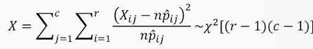
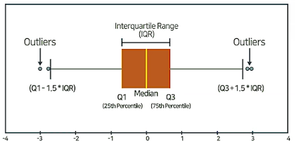

# ProDS
## 데이터 분석 이론(초급) 
### 18. 범주형 변수 간의 독립성검정(Chi-squared test)
* 범주형 변수 : 질적 자료 중에서 그 자료가 가지는 값들이 여러 범주 중 하나로 표현이 되는 경우
1. 카이제곱 검정(Chi-Squared Test) 개요
  * **항상 오른꼬리 검정을 사용**
  * 범주형인 자료를 분석하는데 활용
  * 검정법 2가지
    * 적합도 검정 : 하나의 범주형 변수에 대해 각 범주별 확률에 관한 검정
    * 독립성 검정 : 서로 다른 두 범주형 변수 간에 연관성이 있는지를 검정
1. 카이제곱 독립성(Independence) 검정
  * 2개의 범주형 변수를 요약하는 r x c의 2차원 분할표
    * 두 변수가 독립인 경우에 예상되는 각 셀 별 기대빈도 도출.
    * 각 셀 별 빈도와 기대빈도의 차이의 크기를 이용하여 검정.
    * 차이가 작으면 두 변수는 독립
    * 차이가 크면 두 변수는 독립이 아님.
1. 카이제곱 독립성 검정 절차
  * 가설
    * 귀무가설 H~0~ : 두 범주형 변수는 서로 독립니다.(관계가 없다)
    * 대립가설 H~1~ : 두 범주형 변수는 독립적인 관계가 아니다.(관계가 있다)
  * 검정통계량과 표본분포
    * 귀무가설(H~0~)이 사실인 경우,(=두 표본이 독립인 경우)
    * 표본의 수가 충분히 큰 경우(모든 기대빈도 5이상)
    * 
  * 유의확률(p-value) 계산
    * 귀무가설 H~0~이 사실일 때, 검정통계량 X의 표본분포
    * 
    * x~0~(=표본 자료로부터 계산된 검정통계량의 값)보다 더 큰 값이 나올 확률.
  * 유의수준(significance level) 100 $\alpha$%검정법
    * 자료로부터 계산된 유의확률(p-value)이 주어진 유의 수준 $\alpha$보다 작은 경우에 귀무가설 H~0~를 기각함.
    * p-value <= $\alpha$면, H~0~를 기각.

### 19. 데이터 전처리: 데이터 생성, 데이터 정제
1. 데이터생성
  * 요약변수
    * 수집된 정보를 분석의 목적에 맞게 종합(aggregate)한 변수.
    * 많은 모델에 공통으로 사용될 수 있어, 재활용성이 높음.
    * 예) 단어빈도, 상품별 구매금액, 상품별 구매량, 영화 매출액
  * 파생변수
    * 특정한 의미를 갖는 작위적 정의에 의한 변수
    * 사용자가 특정 조건을 만족하거나 특정함수에 의해 값을 만들어 의미를 부여한 변수
    * 매우 주관적일 수 있으므로 논리적 타당성을 갖추어야 함.
    * 예) 구매상품 다양성 변수, 가격 선호대 변수
2. 결측값 처리법
  * 완전제거법(list-wise deletion)
  * 평균대체법(mean value imputation)
  * 핫덱대체법(hot deck imputation)
    * 동일한 데이터 내에서 결측값이 발생한 관찰치와 유사한 특성을 가진 다른 관찰치의 정보를 이용하여 대체하는 방법.
3. 이상값의 이해
  * 이상값은 다른 데이터와 동떨어진 값을 의미함.
  * 의미를 가진 값일 수도 있으며, 단순히 입력오류로 발생한 값일 수도 있음.
4. 이상값 탐지
  * 상자그림
    * 
  * 표준화 점수(Z-score)
    * 표준화 점수의 절대값이 2 또는 3보다 큰 경우를 이상값으로 진단.
5. 이상값 처리 방법
  * 이상값 제외(trimming)
  * 이상값 대체(winsorization)
  * 변수변환
    * 자료값 전체에 로그변환, 제곱근 변환 등을 적용
6. 연속형 자료의 범주화
  * 변수구간화(binning)
    * 연속형 변수를 구간을 이용하여 범주화하는 과정
    * 효과
      * 이상치 문제를 완화
      * 결측치 처리방법이 될 수 있음.
      * 변수간 관계가 단순화 되어분석시 과적합 방지할 수 있고, 결과해성이 용이해짐.

### 20. 데이터 전처리: 데이터 변환, 데이터 결합
1. 데이터 변환
  * 변환목적
    * 분포의 대칭화
    * 산포를 비슷하게 하기 위해.
    * 변수 간 관계를 단순하게 하기 위해.
  * 분포를 오른쪽으로 이동
    * 지수변환, 제곱변환
  * 분포를 왼쪽으로 이동
    * 로그변환, 제곱근변환
  * 박스콕스 변환(BOX-Cox Transform)
2. 데이터 결합
  * inner join
    * 두 테이블에 키가 공통으로 존재하는 레코드만 결합.
  * full outer join
    * 두 테이블 중 어느 한쪽이라도 존재하는 키에 대한 레코드를 모두결합
  * left join
    * 왼쪽 테이블에 존재하는 키에 대한 레코드를 결합
  * right join
    * 오른쪽 테이블에 존재하는 키에 대한 레코드를 결합

### 21. 머신러닝의 기본 개념 및 방법론의 분류
1. 머신러닝
  * 컴퓨터 시스템에 명시적으로 프로그래밍 하지 않더라도 데이터를 스스로 학습하여 문제를 해결할 수 있게 하는 기술을 의미
  * 사람이 인지하기 어려운 복잡한 규칙과 패턴을 파악하여 의미있는 결과를 얻을 수 있음.
2. 지도학습(Supervised Learning)
  * 라벨이 있는 훈련용 데이터에서, 여러 특성변수를 이용하여 목표변수인 라벨(label)을 예측하도록 모델을 학습함.
  * 종류
    * 회귀(regression) 알고리즘
      * 라벨의 데이터 타입이 라벨이 **연속형**.
    * 분류(classification) 알고리즘
      * 라벨의 데이터 타입이 라벨이 **범주혐**.
3. 비지도학습(Unsupervised Learning)
  * 라벨이 없는 훈련용 데이터에서 특징 변수들 간의 관계나 유사성을 기반으로 의미있는 패턴을 추출.
  * 군집화(clustering), 차원축소(dimension reduction), 추천시스템(recommendation)등에 활용됨.
4. 강화학습(Reinforcement Learning)
  * 행동하는 주체(agent)가 있고 행동을 했을 때의 상태(state)와 보상(reward)을 바꿔주는 환경(environment)으로 구성됨.

